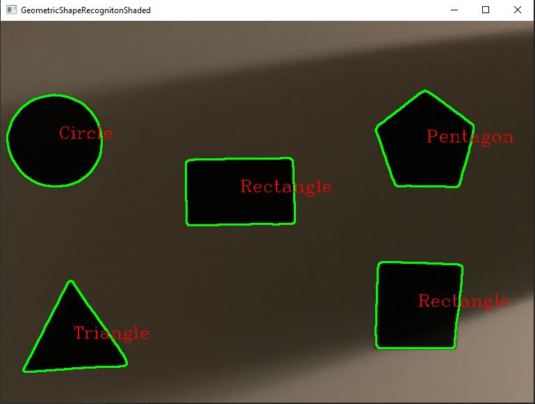

# GeometricShapeRecognitionShaded

An application to detect geometric shapes on shaded surface using OpenCV 

## Limitations

 - Implemented only for:
   - Triangle
   - Rectangle
   - Pentagon
   - Circle
 
## Sample

Code in work

